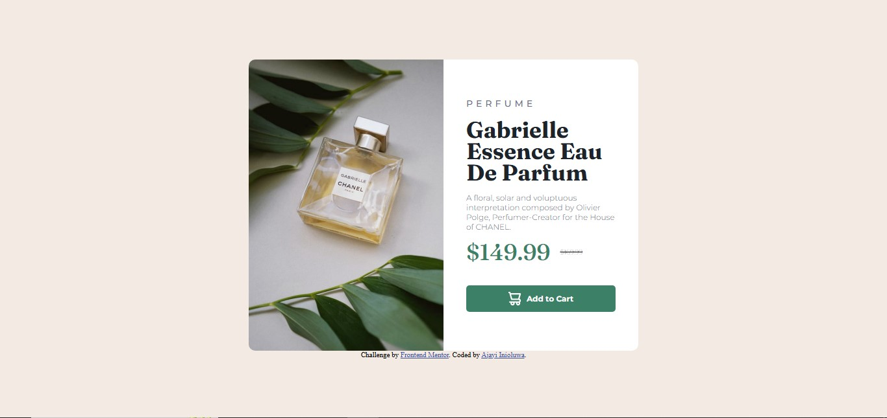

# Frontend Mentor - Product preview card component solution

This is a solution to the [Product preview card component challenge on Frontend Mentor](https://www.frontendmentor.io/challenges/product-preview-card-component-GO7UmttRfa). I built the card with semantic HTML for structure and styled it using CSS with a mobile-first approach. Flexbox and media queries were used to make the layout responsive, swapping between desktop and mobile images. The pricing section and “Add to Cart” button were styled for clarity and usability.

## Table of contents

- [Overview](#overview)
  - [The challenge](#the-challenge)
  - [Screenshot](#screenshot)
  - [Links](#links)
- [My process](#my-process)
  - [Built with](#built-with)
  - [What I learned](#what-i-learned)
  - [Continued development](#continued-development)
- [Author](#author)


## Overview
The Product Preview Card Component is a responsive card design challenge from Frontend Mentor. The goal was to recreate a product card that adapts seamlessly to different screen sizes, while maintaining clean design and accessibility.

The project displays two different product images — one for desktop and one for mobile — controlled through CSS media queries. It also includes a product title, description, pricing section with a discount, and an “Add to Cart” button with an icon.

This challenge helped me practice building layouts with semantic HTML and Flexbox, as well as applying responsive design techniques for a better user experience.

### The challenge

Users should be able to:

- View the layout optimally depending on their device’s screen size (desktop and mobile images)
- See hover and focus states for interactive elements

### Screenshot



### Links

- Solution URL: [Add solution URL here](https://github.com/iniesta375/perfume-product.git)
- Live Site URL: [Add live site URL here](https://perfumepr.netlify.app/)

## My process
Set up the HTML structure

Used semantic tags like <main> and <div> to wrap content.
Added two  tags (desktop and mobile versions) and controlled them with CSS media queries.
Structured the content with headings (<h3>, <h1>), a product description <span>, pricing section, and a button with an icon.
Added the attribution footer as required.

Styled with CSS

Applied a mobile-first workflow, starting with the mobile layout.
Used Flexbox to arrange the image and text side by side on larger screens.
Styled the button with an icon (cart.svg) and text, using background color, padding, and rounded corners for a clean UI.
Added media queries to switch between desktop and mobile product images.

Tested responsiveness

Verified layout across different screen sizes.
Ensured that hover/focus states worked properly on the button.
Confirmed that the attribution section stayed aligned and readable.

### Built with

Semantic HTML5 markup (<main>, <div>, <span>, <button>)
CSS custom properties for colors and spacing
Flexbox for layout structure
Media queries for mobile vs desktop images
Mobile-first workflow

### What I learned

```html
<h1>Some HTML code I'm proud of</h1>
```
```css
.img1 {
  display: block;
}
.img2 {
  display: none;
}

@media (max-width: 600px) {
  .img1 {
    display: none;
  }
  .img2 {
    display: block;
  }
}

I also improved my styling of buttons with icons and text for better accessibility.

### Continued development

I want to continue focusing on:
Writing cleaner CSS for buttons and text spacing
Improving accessibility (e.g., descriptive alt text, button focus states)

Experimenting with CSS Grid for alternative layout approaches

## Author

-LinkedIn -[@AjayiInioluwa] (https://www.linkedin.com/feed/)
- Frontend Mentor - [@iniesta375](https://www.frontendmentor.io/profile/iniesta375)
- Twitter - [@Iniesta37506](https://www.twitter.com/Iniesta37506)
